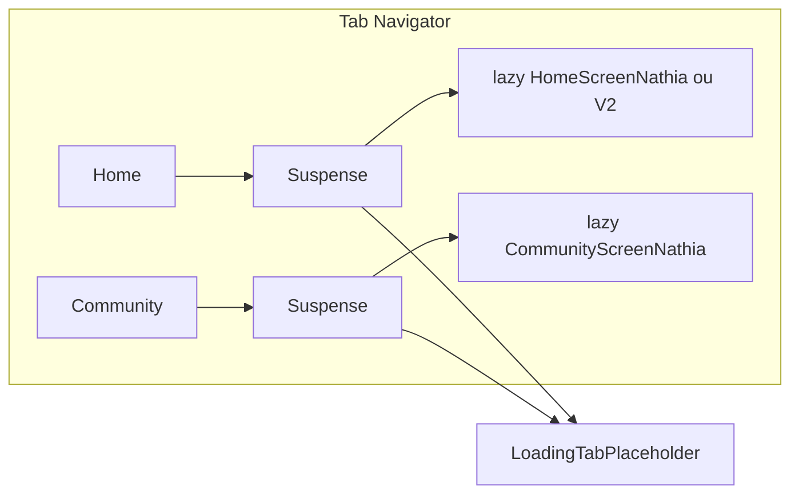

# Plano Phase 3 - Nossa Maternidade

## Decidir e estruturar (Opção B)

Seguir causa raiz do PR grande: redesenhar em PRs menores e independentes. Referências:

- **Contexto de release/correções:** [docs/RELEASE_FIXES_2026-01-20.md](docs/RELEASE_FIXES_2026-01-20.md) (P1.1 tokens, P1.3 a11y; próximos P1.2 NativeWind, P2.1 TODOs). Phase 3 é escopo distinto: dark mode + performance + docs.
- **Fluxo de dev:** [docs/DEV_WORKFLOW.md](docs/DEV_WORKFLOW.md) — antes de cada PR: `lint && tc && t`; branches `feat/` ou `fix/`; health checks antes de build.

**Passos de estruturação:**

1. **Revisar contexto e objetivos** — Alinhar Phase 3 com RELEASE_FIXES (não duplicar P1; Phase 3 = dark refinement + lazy + archive) e com DEV_WORKFLOW (quality-gate obrigatório por PR).
2. **Critérios de divisão** — Por PR: tamanho (máx ~20 arquivos, ~500 linhas úteis); risco (baixo/médio); reversível (revert de merge); pronto = `npm run quality-gate` passa + critérios de aceite do PR cumpridos.
3. **Quebrar em 3 PRs** — Títulos, objetivos e critérios de aceite claros (ver seções PR-3A, PR-3B, PR-3C abaixo).
4. **Ordem e checkpoints** — Executar e mergear em sequência (3A → 3B → 3C); após cada merge, validar app (dark mode visual para 3A; tabs para 3B; docs para 3C).

**Critérios de divisão (detalhe):**

| Critério                 | Regra                                                                                     |
| ------------------------ | ----------------------------------------------------------------------------------------- |
| Tamanho por PR           | Máx ~20 arquivos tocados; preferir &lt; 500 linhas adicionadas por PR                     |
| Risco                    | 3A baixo (só tokens); 3B médio (lazy); 3C baixo (docs)                                    |
| Reversibilidade          | Cada PR mergeável e revertível independentemente                                          |
| Pronto para quality-gate | `npm run quality-gate` passa; critérios de aceite do PR atendidos; sem conflitos com main |

**Decisões:**

- **3 PRs (não 4):** Escopo atual (dark + lazy + docs) cabe bem em 3. Um 4º PR só faria sentido se separar "template de PR" de "archive docs"; opcional e pouco ganho de risco.
- **Priorização por valor ao usuário:** 3A (dark) = maior valor visível; 3B (lazy) = performance; 3C (docs) = valor para manutenção. Ordem 3A → 3B → 3C já prioriza valor ao usuário.

---

## Contexto

O repositório já possui: tema light/dark via [src/theme/tokens.ts](src/theme/tokens.ts) e preset [calmFemtech](src/theme/presets/calmFemtech.ts); [MainTabNavigator](src/navigation/MainTabNavigator.tsx) com imports estáticos e `screenOptions={{ lazy: true }}` (lazy mount do React Navigation); [.cursorrules](.cursorrules) enxuto (~121 linhas); template de PR em [.github/pull_request_template.md](.github/pull_request_template.md). O plano adiciona refinamento visual no dark, code-splitting real (bundle) e documentação de archive, em três PRs para merge limpo e reversível.

## Objetivos

- **3A**: Dark mode com undertone rosa (coesão com brand) sem quebrar presets existentes.
- **3B**: Reduzir bundle inicial carregando telas das tabs sob demanda (React.lazy + Suspense).
- **3C**: Documentar política de archive e opcionalmente enriquecer template de PR.

## Escopo fora do plano

- Não alterar Hono, branches remotas, nem fechar PRs no GitHub (ação manual).
- Não remover regras substantivas do `.cursorrules`; apenas docs em `archive/` e `docs/`.

---

## PR-3A: Dark mode com undertone rosa

**Objetivo:** Superfícies dark com leve tom rosa (brand) mantendo contraste e acessibilidade.

**Arquivos principais:**

1. **Preset calmFemtech** – [src/theme/presets/calmFemtech.ts](src/theme/presets/calmFemtech.ts)
   Ajustar apenas `surface.dark` e, se fizer sentido, `border.dark.accent` / `text.dark.accent` para tons alinhados ao rosa do brand (ex.: bases `#1a1518`, `#251a1d`, `#2d2226` e accent rosa `#d97a8a` ou tokens existentes de [brand.accent](src/theme/tokens.ts)). Manter `canvas`/`base`/`card`/`elevated` com contraste WCAG.
2. **Opcional – tokens base** – [src/theme/tokens.ts](src/theme/tokens.ts)
   Se quiser reuso em outros presets, extrair um pequeno bloco `darkSurfacesPinkTint` (ou nomes alinhados ao padrão do arquivo) e referenciar no calmFemtech em vez de duplicar hex.
3. **Componentes que já usam preset** – Nenhuma alteração obrigatória; [useTheme](src/hooks/useTheme.ts) já expõe `presetTokens.surface` e `presetTokens.text`. Verificar 1–2 telas críticas (ex.: [HomeScreenNathia](src/screens/home/HomeScreenNathia.tsx), [AuthLandingScreenNathia](src/screens/auth/AuthLandingScreenNathia.tsx)) para garantir que usam `useThemeColors()`/`preset` e não cores hardcoded no dark.

**Critérios de sucesso:**
`npm run quality-gate` passa; modo escuro visualmente coerente com rosa; contraste de texto mantido (WCAG AA mínimo).

**Risco:** Baixo. Mudança só em preset/tokens de cor; comportamento e APIs permanecem.

---

## PR-3B: Lazy loading (code-splitting) nas tabs

**Objetivo:** Carregar telas das tabs sob demanda (React.lazy + Suspense) para reduzir bundle inicial, mantendo feature flags e error boundary.

**Nota:** [MainTabNavigator](src/navigation/MainTabNavigator.tsx) já usa `screenOptions={{ lazy: true }}` (React Navigation). Este passo adiciona **code-splitting** (dynamic import), não substitui o lazy mount.

**Arquivos principais:**

1. **Placeholder de carregamento** – Novo: `src/components/LoadingTabPlaceholder.tsx`
   Componente mínimo: `View` centralizado + `ActivityIndicator` + `Text` "Carregando...". Usar tokens de [tokens.ts](src/theme/tokens.ts) (ex.: `brand.accent[500]`, `text.secondary`) e acessibilidade (`accessibilityLabel`, `accessibilityRole="progressbar"`).
2. **MainTabNavigator** – [src/navigation/MainTabNavigator.tsx](src/navigation/MainTabNavigator.tsx)
   - Substituir imports estáticos das telas por `React.lazy()`:
     - `HomeScreenNathia`, `HomeScreenV2` (ambos para preservar [FEATURE_FLAGS.REDESIGN_HOME](src/config/featureFlags.ts))
     - `CommunityScreenNathia`, `MundoScreenNathia`, `HabitosScreenNathia`
   - Manter import estático de `NathIAStackNavigator` (stack interno; lazy opcional em fase posterior).
   - Envolver cada componente de tab em `<Suspense fallback={<LoadingTabPlaceholder />}>` dentro dos wrappers existentes (`HomeScreenWithBoundary`, etc.).
   - Os wrappers continuam a receber `props` e a usar `ScreenErrorBoundary`; apenas o conteúdo interno é lazy.
3. **Exports das telas** – Todas as telas usadas já têm `export default` (HomeScreenNathia, HomeScreenV2, CommunityScreenNathia, MundoScreenNathia, HabitosScreenNathia). Nenhuma alteração necessária.

**Fluxo sugerido (lógica):**

**Critérios de sucesso:**
`npm run quality-gate` passa; navegação entre tabs idêntica ao atual; primeira abertura de cada tab mostra placeholder breve e depois a tela; nenhum erro de hidratação ou tipo (TypeScript estrito).

**Risco:** Médio. Possível flash de placeholder ou edge cases em dispositivos lentos; testar em dispositivo real e em release build.

---

## PR-3C: Documentação de archive e template de PR

**Objetivo:** Deixar explícita a política de arquivamento e, se desejado, enriquecer o template de PR.

**Arquivos:**

1. **archive/README.md** (novo)
   Conteúdo sugerido: propósito da pasta `archive/` (código/docs descontinuados, não removidos); que não é código ativo; como procurar equivalente atual (referência a `src/` ou `docs/`); breve lista de subpastas (audits, design-prototypes, privacy-support, scripts-legacy-2026-01) e o que cada uma contém.
2. **docs/ARCHIVED_FILES_POLICY.md** (novo)
   Política curta: quando arquivar (mudança de estratégia, legacy, protótipos); onde colocar (`archive/<categoria>/`); que arquivado não é suportado; link para [archive/README.md](archive/README.md).
3. **Template de PR** (opcional) – [.github/pull_request_template.md](.github/pull_request_template.md)
   O template atual já cobre governança, design system e acessibilidade. Enriquecimento possível: seção "Resumo" com 3–5 bullets; "Type of Change" com emojis (feat/fix/refactor/docs/chore); "Files Changed" com contagem; "Test Plan" explícito (quality-gate, typecheck, lint, test, iOS/Android). Manter compatibilidade com o checklist atual para não quebrar fluxo existente.

**Critérios de sucesso:**
Novos docs coerentes com a estrutura atual de [archive/](archive/) (apenas [privacy-support/README.md](archive/privacy-support/README.md) existe hoje). Nenhuma alteração em código de produção.

**Risco:** Baixo. Apenas documentação e template.

---

## Ordem de execução e branches

| Ordem | PR  | Branch sugerida              | Dependências                 |
| ----- | --- | ---------------------------- | ---------------------------- |
| 1     | 3A  | `feat/phase3a-dark-mode`     | Nenhuma                      |
| 2     | 3B  | `feat/phase3b-lazy-tabs`     | Nenhuma (independente de 3A) |
| 3     | 3C  | `chore/phase3c-archive-docs` | Nenhuma                      |

Recomendação: implementar e mergear nessa ordem para limitar conflitos e permitir reverter 3B com facilidade se algo surgir em produção.

---

## Validação global

- Em cada PR: `npm run quality-gate` (typecheck, lint, build) deve passar.
- 3A: checar visualmente dark mode em pelo menos um dispositivo/emulador.
- 3B: testar troca de tabs e primeira abertura de cada tab em build de release ou profile.
- 3C: revisão de texto dos novos docs.

---

## Resumo de entregas

| PR  | Entregável principal                                                                          |
| --- | --------------------------------------------------------------------------------------------- |
| 3A  | Dark mode com undertone rosa no preset calmFemtech (+ checagem de uso de tema em 1–2 telas)   |
| 3B  | React.lazy das telas de tab + LoadingTabPlaceholder + Suspense nos wrappers                   |
| 3C  | archive/README.md, docs/ARCHIVED_FILES_POLICY.md e, opcionalmente, template de PR enriquecido |

Nenhuma nova dependência; nenhuma alteração em APIs públicas; mudanças reversíveis por revert de merge.
