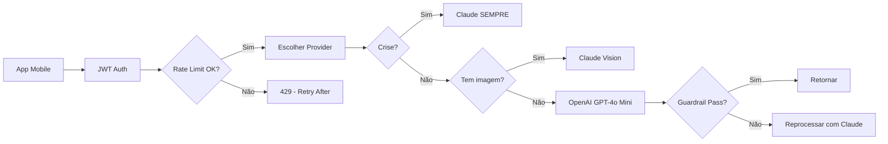

# AI Backend Setup - Nossa Maternidade

## RESUMO

- Edge function `ai` precisa de 3 API keys configuradas no Supabase
- Script automatizado: `scripts/setup-ai-backend.sh`
- Deploy manual: `npx supabase functions deploy ai`

---

## O QUÊ?

Configure os secrets de IA no Supabase para ativar a NathIA no backend.

---

## POR QUÊ IMPORTA?

1. **Segurança** → API keys NUNCA vão para o código cliente
2. **Fallback chain** → OpenAI → Claude → Gemini (redundância)
3. **Rate limiting** → Protege contra abuso (opcional com Redis)

---

## COMO FUNCIONA?

### Arquitetura de Providers

```
┌─────────────────────────────────────────┐
│  Edge Function: ai/index.ts             │
├─────────────────────────────────────────┤
│  1. OpenAI GPT-4o Mini (DEFAULT)        │
│     - Barato ($0.15/MTok)               │
│     - Rápido (< 2s)                     │
│     - Excelente qualidade               │
├─────────────────────────────────────────┤
│  2. Claude Sonnet 4.5 (FALLBACK)        │
│     - Casos sensíveis/crise             │
│     - Vision (ultrassons, fotos)        │
├─────────────────────────────────────────┤
│  3. Gemini 2.0 Flash (DESABILITADO)     │
│     - Grounding com Google Search       │
│     - Sem quota/créditos                │
└─────────────────────────────────────────┘
```

### Fluxo de Requisição



---

## AÇÕES CONCRETAS

### 1. OBTER API KEYS (5-10 min cada)

#### Google AI (Gemini)

```bash
# URL: https://aistudio.google.com/apikey
# 1. Criar/logar conta Google
# 2. Criar novo projeto (se necessário)
# 3. Gerar API key
# 4. Copiar key (começa com "AI...")
```

#### OpenAI

```bash
# URL: https://platform.openai.com/api-keys
# 1. Criar/logar conta OpenAI
# 2. Adicionar crédito (mínimo $5)
# 3. Criar nova secret key
# 4. Copiar key (começa com "sk-...")
# ⚠️  Guardar imediatamente - só aparece 1 vez
```

#### Anthropic (Claude)

```bash
# URL: https://console.anthropic.com/
# 1. Criar/logar conta Anthropic
# 2. Ir em API Keys
# 3. Criar nova key
# 4. Copiar key (começa com "sk-ant-...")
```

---

### 2. CONFIGURAR NO SUPABASE (2 formas)

#### FORMA 1: Script Automatizado (RECOMENDADO)

```bash
# No terminal Git Bash
cd /c/Users/User/Desktop/NossaMaternidade
./scripts/setup-ai-backend.sh
```

O script vai:

1. ✅ Verificar se você está logado no Supabase
2. ✅ Linkar o projeto (se necessário)
3. ✅ Pedir cada API key interativamente (entrada oculta)
4. ✅ Configurar secrets no Supabase
5. ✅ Fazer deploy da edge function `ai`
6. ✅ Validar que tudo está OK

#### FORMA 2: Manual (Supabase Dashboard)

```bash
# 1. Abrir Supabase Dashboard
https://supabase.com/dashboard/project/lqahkqfpynypbmhtffyi/settings/vault

# 2. Ir em: Settings → Edge Functions → Secrets

# 3. Adicionar cada secret:
GEMINI_API_KEY=sua-key-aqui
OPENAI_API_KEY=sua-key-aqui
ANTHROPIC_API_KEY=sua-key-aqui
```

---

### 3. DEPLOY DA EDGE FUNCTION

```bash
# Deploy automático (pelo script)
./scripts/setup-ai-backend.sh

# OU deploy manual
npx supabase functions deploy ai
```

**Verificar deploy:**

```bash
# Listar funções deployadas
npx supabase functions list

# Ver logs em tempo real
npx supabase functions logs ai --follow
```

---

### 4. VALIDAR QUE FUNCIONA

#### Teste no App Mobile

1. Abrir app (`npm start`)
2. Ir para aba **NathIA** (tab central)
3. Enviar mensagem: "Oi, você está funcionando?"
4. Resposta deve vir em < 3s

#### Teste via cURL (Backend Direto)

```bash
# Obter JWT token do app (copiar do AsyncStorage ou login)
JWT_TOKEN="seu-jwt-aqui"

curl -X POST https://lqahkqfpynypbmhtffyi.supabase.co/functions/v1/ai \
  -H "Authorization: Bearer $JWT_TOKEN" \
  -H "Content-Type: application/json" \
  -d '{
    "messages": [
      {"role": "user", "content": "Oi, você está funcionando?"}
    ],
    "provider": "openai"
  }'
```

**Resposta esperada:**

```json
{
  "content": "Oi! Sim, estou funcionando perfeitamente...",
  "usage": {
    "promptTokens": 120,
    "completionTokens": 45,
    "totalTokens": 165
  },
  "provider": "openai",
  "latency": 1834,
  "requestId": "req_abc123"
}
```

---

## ALERTAS

### ⚠️ Secrets NÃO aparecem em logs

Por segurança, secrets do Supabase são ocultados. Se configurou errado, você NÃO verá a key nos logs. Sintomas:

```
Error: AI provider failed
Details: Invalid API key
```

**Solução:** Reconfigurar secret corretamente.

---

### ⚠️ Rate Limiting sem Redis

Se NÃO configurar Upstash Redis:

- ✅ Rate limiting ainda funciona (fallback in-memory)
- ⚠️ Contador é resetado a cada deploy/restart da função
- ⚠️ Múltiplas instâncias da função = contadores independentes

**Para produção:** Configure Redis (gratuito em https://console.upstash.com/)

---

### ⚠️ Custos das APIs

| Provider  | Modelo            | Custo / 1M Tokens | Nossa Média  |
| --------- | ----------------- | ----------------- | ------------ |
| OpenAI    | GPT-4o Mini       | $0.15 (input)     | ~$0.02/dia   |
| Anthropic | Claude Sonnet 4.5 | $3.00 (input)     | Fallback     |
| Google    | Gemini 2.0 Flash  | $0.075 (input)    | Desabilitado |

**Estimativa:** ~$5-10/mês para 1000 usuárias ativas (maioria usa free tier: 6 msgs/dia)

---

## TROUBLESHOOTING

### Problema: "Invalid or expired token"

```bash
# Verificar JWT no app
# AsyncStorage → @nm_auth_token
# Copiar token e testar manualmente com curl
```

### Problema: "All AI providers failed"

```bash
# Ver logs da edge function
npx supabase functions logs ai --tail 50

# Verificar secrets configurados
npx supabase secrets list

# Reconfigurar se necessário
npx supabase secrets set OPENAI_API_KEY=nova-key
```

### Problema: "Rate limit exceeded"

```json
{
  "error": "Rate limit exceeded. Try again in a minute.",
  "retryAfter": 42,
  "remaining": 0,
  "source": "redis"
}
```

**Normal!** Usuário atingiu 20 req/min. Aguardar 1 minuto.

---

## RECURSOS EXTRAS

### Upstash Redis (Rate Limiting - Opcional)

```bash
# 1. Criar conta: https://console.upstash.com/
# 2. Criar banco Redis (grátis: 10K requests/dia)
# 3. Copiar: REST URL + REST Token
# 4. Configurar no Supabase:

npx supabase secrets set UPSTASH_REDIS_REST_URL=https://xxx.upstash.io
npx supabase secrets set UPSTASH_REDIS_REST_TOKEN=xxx
```

### Logs Estruturados

Edge function `ai` usa structured logging (JSON):

```bash
# Ver métricas
npx supabase functions logs ai | grep "request_metrics"

# Ver falhas
npx supabase functions logs ai | grep "level.*error"

# Ver fallbacks (provider switch)
npx supabase functions logs ai | grep "provider_fallback"
```

---

## CHECKLIST FINAL

- [ ] Obter 3 API keys (Gemini, OpenAI, Claude)
- [ ] Configurar secrets no Supabase
- [ ] Deploy edge function `ai`
- [ ] Testar no app mobile
- [ ] Verificar logs (sem erros de auth/API)
- [ ] (Opcional) Configurar Upstash Redis

---

**Tempo total:** 15-20 minutos
**Custo mensal estimado:** $5-10 (1000 usuárias ativas)
**Status:** Backend 100% funcional após este setup

---

_Documentado em: 2026-01-31_
_Última atualização: 2026-01-31_
