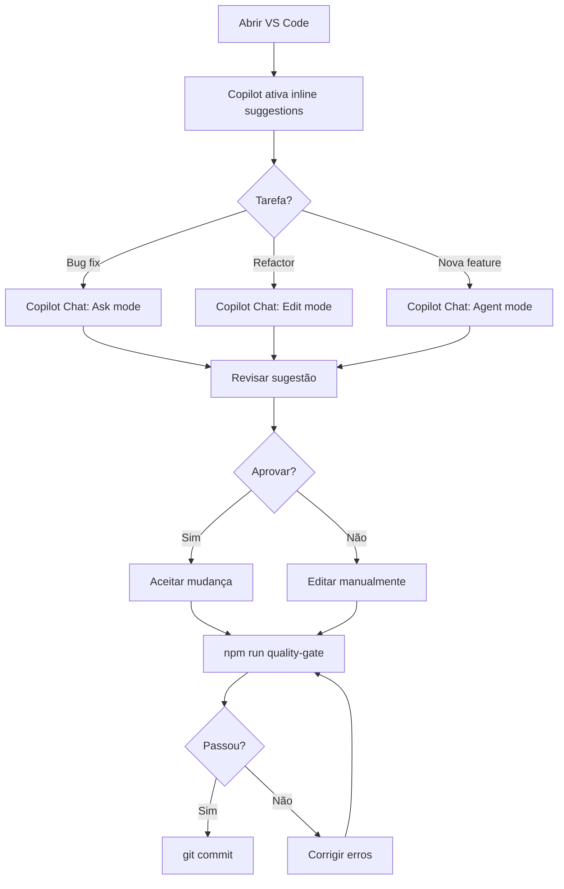
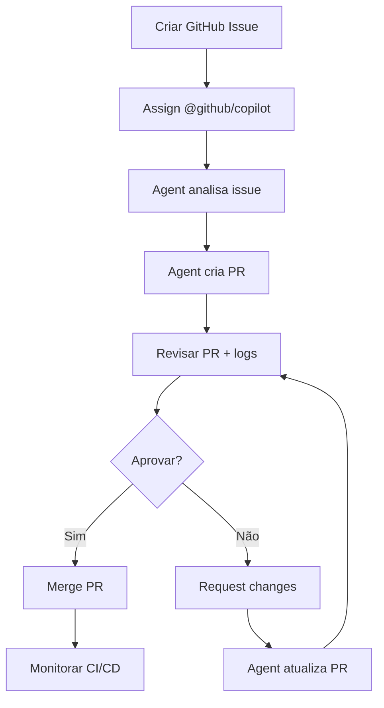

# GitHub Copilot + MCP Setup - Nossa Maternidade

> **Safe-by-default:** Este guia configura MCP com permissões mínimas, expandindo apenas quando necessário.
>
> **Baseado em:** [GitHub Docs - MCP with Copilot](https://docs.github.com/en/enterprise-cloud@latest/copilot/how-tos/use-copilot-agents/coding-agent/extend-coding-agent-with-mcp)

---

## 📋 TL;DR

```bash
# 1. Instalar extensões
code --install-extension github.copilot
code --install-extension github.copilot-chat

# 2. Configurar secrets (se usar GitHub coding agent)
gh secret set COPILOT_MCP_GITHUB_TOKEN --body "ghp_your_token_here"

# 3. Verificar setup
# VS Code: Ctrl+Shift+P → "GitHub Copilot: Chat"
# .mcp.json já configurado ✅
```

---

## 🎯 Dois Ambientes Diferentes

### 1. **GitHub Copilot no VS Code** (Local)

- **Onde roda:** No seu editor (VS Code/Cursor)
- **Controles:** Você revisa sugestões inline/chat antes de aceitar
- **MCP:** Configurado via `.mcp.json` no projeto
- **Ferramentas:** Chat, Inline Suggestions, Agents, Smart Actions
- **Documentação oficial:** [VS Code Copilot Docs](https://code.visualstudio.com/docs/copilot/getting-started)

### 2. **GitHub Copilot coding agent** (GitHub.com)

- **Onde roda:** No ambiente do GitHub (cria PRs automaticamente)
- **Controles:** Configuração via Repository Settings → Copilot
- **MCP:** Configurado via Settings com secrets `COPILOT_MCP_*`
- **Fluxo:** Assign issue → Agent cria PR → Você revisa logs/diffs
- **Documentação oficial:** [GitHub MCP Extension Docs](https://docs.github.com/en/enterprise-cloud@latest/copilot/how-tos/use-copilot-agents/coding-agent/extend-coding-agent-with-mcp)

**CRÍTICO:** Este guia foca em **ambos**, mas você precisa entender a diferença.

---

## 🔐 Segurança (Safe-by-Default)

### Princípios

1. **Start read-only** - Comece com `readonly` toolsets, expanda apenas se necessário
2. **Minimal toolsets** - Evite `"*"` wildcard (muito amplo)
3. **Trust boundaries** - MCP servers rodam em processos isolados
4. **Secret management** - Use `COPILOT_MCP_*` env vars, **nunca em prompts**
5. **Review logs** - Monitore atividade suspeita regularmente

### Exemplo de Risco (NÃO FAÇA ISSO)

```json
// ❌ PERIGOSO - Acesso total sem restrições
{
  "github": {
    "toolsets": ["*"], // Acesso total (criar, deletar, modificar)
    "env": {
      "GITHUB_TOKEN": "ghp_token_in_config" // Secret exposto
    }
  }
}
```

### Exemplo Seguro (FAÇA ISSO)

```json
// ✅ SEGURO - Read-only + secret via env var
{
  "github-readonly": {
    "toolsets": ["readonly"], // Apenas leitura
    "env": {
      "GITHUB_PERSONAL_ACCESS_TOKEN": "${COPILOT_MCP_GITHUB_TOKEN}" // Secret via env
    }
  }
}
```

---

## 🛠️ Setup - VS Code Local

### 1. Instalar Extensões

**Método 1: VS Code UI**

1. Abrir Extensions (Ctrl+Shift+X)
2. Buscar: `GitHub Copilot`
3. Instalar: `GitHub Copilot` + `GitHub Copilot Chat`

**Método 2: CLI**

```bash
code --install-extension github.copilot
code --install-extension github.copilot-chat
```

**Verificar instalação:**

```bash
code --list-extensions | grep copilot
# Deve mostrar:
# github.copilot
# github.copilot-chat
```

### 2. Autenticar com GitHub

1. Abrir Command Palette (Ctrl+Shift+P)
2. Digitar: `GitHub Copilot: Sign In`
3. Seguir fluxo OAuth no browser
4. Verificar status na status bar (canto inferior direito)

### 3. Configurar MCP (Já pronto!)

O arquivo `.mcp.json` já está configurado com:

- ✅ **expo-mcp** - Expo builds (iOS/Android)
- ✅ **memory-keeper** - Persistência de contexto
- ✅ **sequential-thinking** - Raciocínio complexo
- ✅ **context7** - Docs atualizadas (React Native, Expo, Supabase)
- ✅ **github-readonly** - GitHub read-only (seguro)
- ✅ **filesystem-readonly** - Filesystem read-only (seguro)

**Nenhuma ação necessária** - config já está safe-by-default.

### 4. Testar Copilot Chat

1. Abrir Command Palette (Ctrl+Shift+P)
2. Digitar: `GitHub Copilot: Chat`
3. Testar prompt:

```
Show me the current structure of src/components/ui/
```

Se funcionar, setup está completo! ✅

---

## 🤖 Setup - GitHub Coding Agent (Opcional)

### Quando usar?

- **Use se:** Quer que Copilot crie PRs automaticamente via issues
- **Não use se:** Prefere controle manual (recomendado inicialmente)

### 1. Habilitar no Repositório

1. Ir para: `https://github.com/nossamaternidade/nossamaternidade/settings`
2. Clicar em: **Copilot** (sidebar esquerda)
3. Habilitar: **"Allow GitHub Copilot to create pull requests"**

### 2. Configurar MCP Secrets (se necessário)

Se você habilitou `github-readonly` no `.mcp.json`, precisa criar o secret:

```bash
# Criar GitHub Personal Access Token (PAT)
# https://github.com/settings/tokens
# Scopes: repo (read-only)

# Adicionar como secret
gh secret set COPILOT_MCP_GITHUB_TOKEN --body "ghp_your_token_here"
```

**IMPORTANTE:** Use apenas scopes mínimos (`repo:read`) para segurança.

### 3. Testar Fluxo

1. Criar issue no GitHub:

```markdown
Title: Add dark mode toggle to settings

Description:
Implement a dark mode toggle in the Settings screen using our design tokens.

Requirements:

- Use Tokens.theme.dark and Tokens.theme.light
- Persist preference in AsyncStorage
- Apply to entire app navigation
```

2. Assignar issue para **@github/copilot**
3. Aguardar PR automático
4. Revisar PR, logs, e diffs **antes de merge**

---

## 📖 Copilot Features (VS Code)

### 1. Inline Suggestions

- **Como usar:** Digitar código → Copilot sugere automaticamente
- **Aceitar:** Tab
- **Rejeitar:** Esc
- **Ver alternativas:** Alt+] (próxima) / Alt+[ (anterior)

### 2. Chat

- **Abrir:** Ctrl+Shift+P → "GitHub Copilot: Chat"
- **Modos:**
  - **Ask** - Perguntas e diagnóstico
  - **Edit** - Refactor multi-arquivo
  - **Agent** - Execução coordenada

**Exemplo de prompts:**

```
# Diagnóstico
Show me all TypeScript errors in src/components/

# Refactor
Refactor HomeScreen.tsx to use design tokens instead of hardcoded colors

# Agent (execução coordenada)
Create a new component AvatarUpload with image picker, cropping, and upload to Supabase storage
```

### 3. Smart Actions

- **Fix TypeScript errors** - Corrige erros TS automaticamente
- **Generate tests** - Cria testes para componente/função
- **Explain code** - Explica bloco de código selecionado
- **Generate docs** - Cria JSDoc/comentários

**Como usar:** Selecionar código → Botão direito → "Copilot" → Ação desejada

### 4. Custom Agents (Experimental)

- **Localização:** `.github/copilot-instructions.md` (já criado! ✅)
- **Formato:** Markdown com instruções específicas do projeto
- **Copilot lê automaticamente** e adapta sugestões ao projeto

---

## 🚨 Troubleshooting

### Copilot não sugere nada

**Causa:** Não autenticado ou licença inválida
**Solução:**

```bash
# Verificar status
# VS Code status bar → "Copilot" → Ver ícone

# Re-autenticar
Ctrl+Shift+P → "GitHub Copilot: Sign Out"
Ctrl+Shift+P → "GitHub Copilot: Sign In"
```

### MCP server não encontrado

**Causa:** Servidor MCP não instalado ou path incorreto
**Solução:**

```bash
# Reinstalar server
npx -y @modelcontextprotocol/server-github

# Verificar logs
# VS Code Output → "GitHub Copilot MCP"
```

### Secret `COPILOT_MCP_*` não reconhecido

**Causa:** Secret não configurado ou nome errado
**Solução:**

```bash
# Listar secrets
gh secret list

# Criar secret (exatamente como no .mcp.json)
gh secret set COPILOT_MCP_GITHUB_TOKEN --body "ghp_token"
```

### Copilot suggestions muito genéricas

**Causa:** Não está lendo `.github/copilot-instructions.md`
**Solução:**

1. Verificar que arquivo existe: `.github/copilot-instructions.md` ✅
2. Recarregar VS Code: Ctrl+Shift+P → "Reload Window"
3. Testar prompt específico do projeto:

```
Create a new NathIA chat message component following our design system
```

---

## 📚 Documentação Oficial

### GitHub Copilot (VS Code)

- **Getting Started:** [https://code.visualstudio.com/docs/copilot/getting-started](https://code.visualstudio.com/docs/copilot/getting-started)
- **Chat:** [https://code.visualstudio.com/docs/copilot/chat/copilot-chat](https://code.visualstudio.com/docs/copilot/chat/copilot-chat)
- **Customization:** [https://code.visualstudio.com/docs/copilot/customization/overview](https://code.visualstudio.com/docs/copilot/customization/overview)
- **Security:** [https://code.visualstudio.com/docs/copilot/security](https://code.visualstudio.com/docs/copilot/security)
- **Cheat Sheet:** [https://code.visualstudio.com/docs/copilot/reference/copilot-vscode-features](https://code.visualstudio.com/docs/copilot/reference/copilot-vscode-features)

### GitHub Copilot Coding Agent

- **MCP Extension:** [https://docs.github.com/en/enterprise-cloud@latest/copilot/how-tos/use-copilot-agents/coding-agent/extend-coding-agent-with-mcp](https://docs.github.com/en/enterprise-cloud@latest/copilot/how-tos/use-copilot-agents/coding-agent/extend-coding-agent-with-mcp)

### MCP Protocol

- **Specification:** [https://spec.modelcontextprotocol.io/](https://spec.modelcontextprotocol.io/)
- **GitHub MCP Server:** [https://github.com/modelcontextprotocol/servers/tree/main/src/github](https://github.com/modelcontextprotocol/servers/tree/main/src/github)

---

## 🎓 Melhores Práticas

### 1. Start Small

- Use Copilot para **assistência**, não automação total
- Revise sempre antes de aceitar sugestões
- Comece com Chat (Ask mode) antes de usar Agents

### 2. Leverage Project Context

- `.github/copilot-instructions.md` ✅ (já configurado)
- `claude.md` (v2.0) - Copilot lê automaticamente
- `docs/claude/*` - Documentação detalhada

### 3. Security First

- **Nunca** coloque secrets em prompts
- **Sempre** use `COPILOT_MCP_*` env vars
- **Revise** MCP server logs regularmente
- **Start read-only** e expanda permissões apenas se necessário

### 4. Quality Gates

- **SEMPRE** rode `npm run quality-gate` após mudanças sugeridas por Copilot
- **Revise** diffs antes de commit
- **Teste** funcionalidade alterada

### 5. Feedback Loop

- Se sugestão está ruim, use **thumbs down** no Copilot Chat
- Adicione contexto ao `.github/copilot-instructions.md` se necessário
- Reporte bugs/limitações via GitHub Issues

---

## 🔄 Workflow Recomendado

### Desenvolvimento Diário (VS Code)



### PR Automatizado (GitHub Coding Agent)



---

## ✅ Checklist de Setup

- [x] Extensões VS Code instaladas (`github.copilot` + `github.copilot-chat`)
- [x] `.mcp.json` configurado (safe-by-default)
- [x] `.github/copilot-instructions.md` criado
- [x] `.vscode/extensions.json` atualizado
- [ ] Autenticar Copilot no VS Code (manual)
- [ ] Testar Copilot Chat (manual)
- [ ] (Opcional) Configurar GitHub coding agent
- [ ] (Opcional) Adicionar secrets `COPILOT_MCP_*` para MCP servers

---

## 📞 Suporte

**Problemas com Copilot:**

- GitHub Support: [https://support.github.com/](https://support.github.com/)
- Community: [https://github.community/](https://github.community/)

**Problemas com MCP:**

- MCP Spec: [https://spec.modelcontextprotocol.io/](https://spec.modelcontextprotocol.io/)
- GitHub Issues: [https://github.com/modelcontextprotocol/servers/issues](https://github.com/modelcontextprotocol/servers/issues)

**Problemas com o projeto:**

- Project Lead: Lion (eugabrielmktd@gmail.com)
- Documentação: `/claude.md` + `docs/claude/`

---

**Versão:** 1.0
**Última atualização:** 2026-01-26
**Autor:** Development Team
